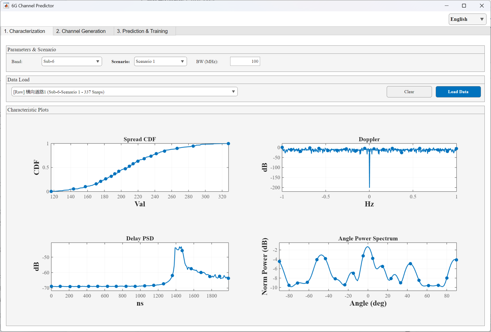
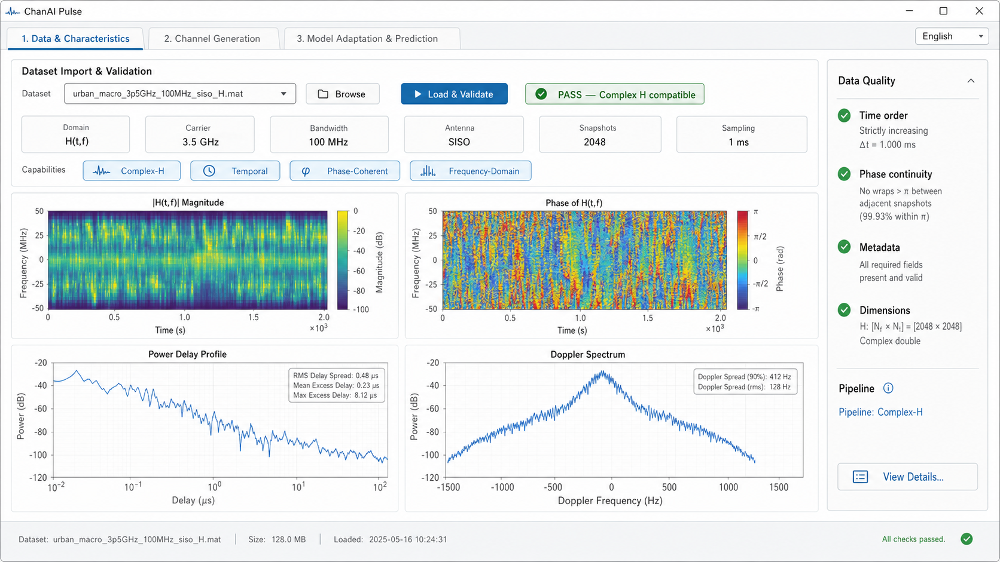
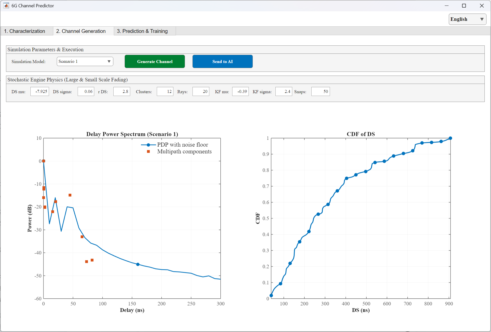
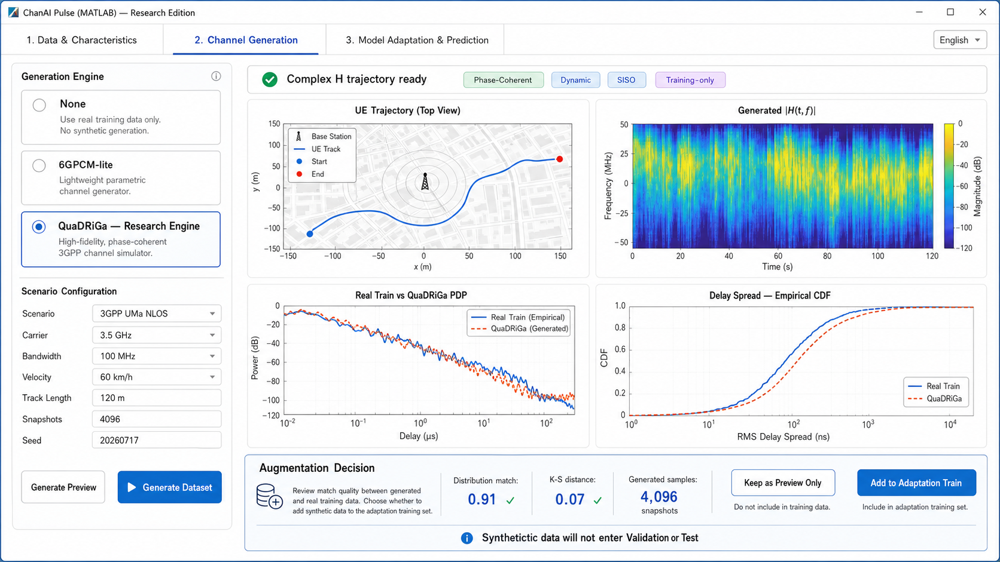
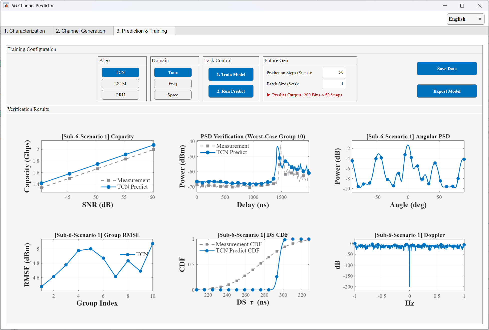
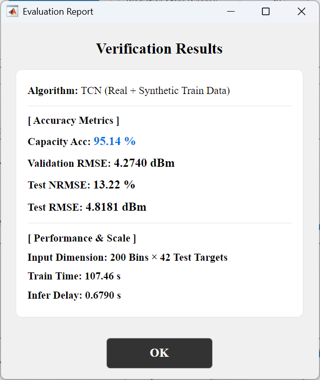
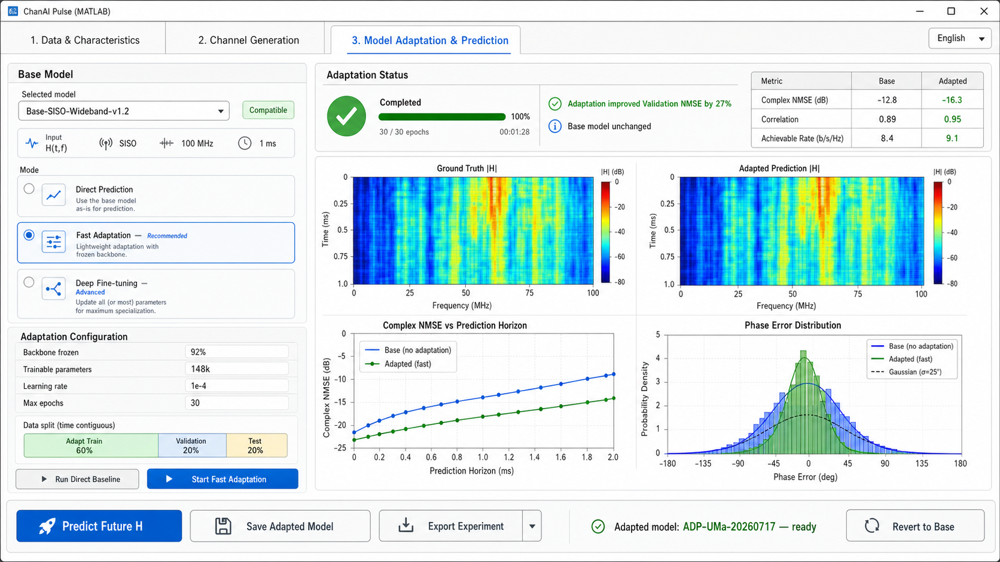

# ChanAI Pulse 平台功能设计

**文档用途：** 供项目成员与 AI 协作者共同维护平台三大模块的页面内容、功能边界、交互流程和验收依据。  
**当前版本：** 2026-07-20  
**当前状态：** 模块一设计已形成讨论基线；模块二、模块三待后续补充。  
**重要说明：** 本文包含目标设计，不代表所有功能均已实现。实现状态必须以代码、测试和人工验收结果为准。

## 0. 三模块总体框架

| 模块 | 暂定名称 | 主要职责 | 当前文档状态 |
| --- | --- | --- | --- |
| 模块一 | 数据与信道特征 | 数据导入、数据质量验证、物理元数据确认和特征可视化 | 已形成设计基线 |
| 模块二 | 信道生成与数据准备 | 可选生成、质量评估和训练数据治理 | 已形成设计基线 |
| 模块三 | 模型适配与预测 | Base Model、用户适配、独立评价与未来H预测 | 已形成设计基线 |

三个模块遵循同一条状态传递原则：后续模块只能使用前一模块已经验证、具有明确数据契约和物理坐标的数据；不能仅凭“图能画出来”判断数据可用于生成、训练或预测。

---

## 1. 模块一：数据导入、质量验证与特征可视化

### 1.1 模块目标

模块一回答四个问题：

1. 用户上传的是什么类型的信道数据？
2. 数据的维度、单位、物理坐标和时间顺序是否明确且一致？
3. 数据能够进入哪一条平台处理管线？
4. 在不伪造缺失信息的前提下，平台能够展示哪些可信的信道特征？

模块一不是单纯的“画四张图”。它是整个后续生成、模型适配和预测流程的数据入口与质量门禁。

### 1.2 当前实机界面



当前页面的四张图为：

| 图表 | 当前含义 | 主要用途 |
| --- | --- | --- |
| Spread CDF | 时延扩展等统计量的累计分布 | 观察统计分布、分位点和离散程度 |
| Doppler | 多普勒相关曲线 | 观察动态变化或多普勒功率特征 |
| Delay PSD | 功率随时延的分布 | 观察多径能量和时延结构 |
| Angle Power Spectrum | 功率随角度的分布 | 观察角域能量；仅在数据确有可信角度信息时有效 |

当前页面还包括：频段、场景、带宽输入，数据集选择，`Load Data` 和 `Clear`。

该界面适合现有功率/SAGE 参数类数据的特征展示，但目前还不足以表达复数 (H) 数据的相位、真实频率维和数据质量状态。

### 1.3 未来目标概念图



概念图面向未来 Complex-H 数据管线，默认展示：

| 图表 | 数据来源 | 表达内容 |
| --- | --- | --- |
| \(|H(t,f)|\) Magnitude | 复数频域信道 \(H(t,f)\) | 信道幅度随时间和频率的二维变化 |
| Phase of \(H(t,f)\) | 复数频域信道 \(H(t,f)\) | 信道相位随时间和频率的二维变化 |
| Power Delay Profile | 由 \(H(t,f)\) 经可追溯 IFFT 得到 \(h(t,\tau)\) 后统计 | 多径功率随物理时延的分布 |
| Doppler Spectrum | 由具有真实时间采样信息的动态复数信道计算 | 功率随物理多普勒频率的分布 |

概念图与当前界面不是一一对应的换皮：

- 当前 `Spread CDF` 被 Complex-H 幅度热力图替代；CDF仍保留为扩展统计视图。
- 当前 `Angle Power Spectrum` 被 Complex-H 相位热力图替代；角度谱仅在阵列和角度条件满足时显示。
- `Delay PSD` 与未来 `PDP` 相关，但未来PDP必须具有明确、可追溯的时延轴。
- 两个版本的多普勒图概念相关，但未来版本必须使用真实时间间隔和明确的Hz坐标。

### 1.4 页面推荐布局

#### A. 顶部：数据集导入与验证

建议控件：

- 数据集选择框：显示最近导入或已登记的数据集。
- `Browse`：从本地选择文件或目录。
- `Load & Validate`：加载并执行数据契约与物理一致性检查。
- 验证状态徽标：例如 `PASS — Complex-H Compatible`、`PASS — Legacy Power Compatible`、`WARNING` 或 `FAIL`。
- `Clear`：清空当前工作数据；执行前应避免误清除未保存结果。

`Load & Validate` 应替代“只加载、不解释”的入口。加载成功不等于验证通过，验证失败时不得静默进入后续模块。

#### B. 数据元信息摘要

页面应直接显示：

- 数据域，例如 \(H(t,f)\)、\(h(t,\tau)\)、PDP/DPSD 或路径参数；
- 载频与频段；
- 带宽、频率间隔和频率采样点数；
- SISO/MIMO配置与 \(N_t/N_r\)；
- 快拍数量；
- 时间戳或时间采样间隔；
- 数据精度和复数类型；
- 原始维度及平台内部维度映射。

系统应优先从可信元数据读取这些信息。只有无法自动识别时才允许用户补充，并将“用户填写”与“文件原生值”明确区分。

#### C. 数据能力标签

建议使用能力标签快速说明当前数据支持的功能：

- `Complex-H`：保留复数实部和虚部；
- `Temporal`：具备有序时间快拍和时间尺度；
- `Phase-Coherent`：相位在快拍间具有可解释的一致性；
- `Frequency-Domain`：具备真实频率轴；
- `Delay-Domain`：具备真实时延轴；
- `MIMO/Spatial`：具备阵列维度及阵列元数据；
- `Angular`：具备可验证的到达角/离开角或可支持角域变换的阵列信息。

能力标签必须由检查结果生成，不能仅由文件名或用户选择推断。

页面还应显示自动识别结果、识别置信度和判定依据，例如：

- `Direct Complex-H`：文件直接包含复数矩阵，或包含可以无损组合的实部/虚部，并具有时间、频率和维度定义；
- `Reconstructable SAGE`：包含逐径复增益/相位、时延、快拍顺序及必要系统参数，可以重建派生的 \(H\)；
- `Legacy SAGE / Power`：包含PDP、DPSD、功率或不完整路径参数，只能进入现有统计特征管线；
- `Ambiguous`：存在多种可能解释，需要用户确认字段、单位或维度；
- `Unsupported`：缺少建立可信数据契约所需的关键内容。

自动识别以实际数据内容为依据，不以文件名、扩展名或用户选择作为唯一依据。对于由SAGE参数重建的 \(H\)，界面必须标注 `Derived H from SAGE`，不能与直接测量或仿真输出的原始 \(H\) 混同。

#### D. 中央：四图主视区

四图主视区根据数据管线自适应，不强制所有数据显示同一组图。

**Complex-H 管线默认四图：**

1. \(|H(t,f)|\) 幅度热力图；
2. \(\angle H(t,f)\) 相位热力图；
3. PDP；
4. Doppler Spectrum。

**Legacy Power / SAGE 管线默认四图：**

1. PDP或Delay PSD；
2. 经验DS CDF；
3. Doppler Spectrum；
4. Angle Power Spectrum，仅在可信角度字段存在时显示。

建议在主视区增加“图表选择/更多特征”，按数据能力提供：经验CDF、时域包络、频率相关性、时间相关性、空间相关性、角度谱、K因子分布等扩展视图。

#### E. 右侧：Data Quality 面板

建议检查并展示：

- 时间顺序是否严格递增；
- 时间采样是否稳定，是否存在缺帧或重复快拍；
- 复数值、NaN、Inf、全零或异常值情况；
- 相邻快拍相位连续性及可能的相位跳变；
- 必需元数据是否齐全；
- 数据维度是否与声明一致；
- 带宽、频率间隔、FFT点数和时延间隔是否互相一致；
- 当前允许进入的处理管线；
- 阻断后续流程的错误和不阻断流程的警告。

提供 `View Details...` 查看字段映射、单位、原始维度、检查规则、警告原因和建议处理方式。

#### F. 底部：状态栏

建议显示：

- 当前数据集名称；
- 文件数量、数据大小和加载时间；
- 当前工作数据版本或哈希；
- 当前管线；
- 总体检查结果；
- 是否允许进入模块二和模块三。

### 1.5 自动识别与数据预适配

#### 1.5.1 自动识别的职责

自动识别负责回答“数据是什么、能够做什么”，建议按以下顺序执行：

1. 识别文件容器与字段结构，例如MAT、HDF5、CSV、目录快拍序列等；
2. 检查数据是复数矩阵、分离的实部/虚部、功率谱、PDP/DPSD，还是SAGE逐径参数；
3. 根据字段、维度长度、时间戳、频率轴、时延轴和阵列元数据推断各维语义；
4. 检查单位及物理一致性，例如带宽、频率间隔、FFT点数和时延分辨率是否相容；
5. 生成数据能力标签和候选管线；
6. 当推断不唯一时要求用户确认，保存确认内容和判定依据；
7. 输出机器可读的 `Capability Profile` 和数据验证报告，供模块二、模块三及AI协作者读取。

自动识别只进行判断，不应为了“识别成功”而补造缺失的相位、时间轴、频率轴、天线维度或角度信息。

#### 1.5.2 数据预适配的职责

数据预适配回答的是“怎样把已识别的数据安全地整理成平台统一输入”。它位于数据识别之后、信道生成和模型输入之前，与模块三的“模型参数适配”不是同一件事。

典型的数据预适配操作包括：

- 将不同数据集的字段名映射到统一字段；
- 将维度顺序转换为平台约定，例如 \([T,F,N_r,N_t]\)；
- 将分离的实部/虚部无损组合为复数 \(H\)，或保留为模型使用的双通道表示；
- 在依据明确时统一Hz、MHz、s、ms、ns等单位；
- 按时间戳排序，标记重复、缺失或异常快拍；
- 保存并传递显式时间、频率、时延和阵列坐标；
- 根据后续模型要求构造历史窗口和预测目标，但不提前使用未来测试数据；
- 使用训练段统计量完成归一化，并把归一化参数作为数据契约的一部分保存；
- 在用户确认后执行必要的重采样、裁剪、填充或缺失值处理，并记录其影响。

数据预适配必须保留原始数据只读副本，并至少产生以下结果：

1. `Raw Dataset`：未经改写的原始输入引用；
2. `Canonical Dataset`：统一字段和维度后的平台数据；
3. `Data Contract`：维度、单位、坐标、复数表示和来源说明；
4. `Pre-adaptation Report`：执行过的排序、单位转换、重采样、裁剪、填充、异常处理和警告；
5. `Capability Profile`：允许使用的图表、生成器和预测模型。

#### 1.5.3 不允许静默执行的操作

以下操作可能改变科学含义，必须明确提示、记录，并在必要时由用户确认：

- 猜测未知带宽、采样间隔或频率轴；
- 把匿名200/500个bin直接解释为物理时延或频率；
- 通过功率数据伪造相位或复数 \(H\)；
- 对相位进行未记录的unwrap、平滑或插值；
- 为满足网络输入尺寸静默裁剪、补零或重采样；
- 使用全数据或未来测试段计算归一化统计量；
- 把SAGE重建的派生 \(H\) 标记为原始实测 \(H\)。

#### 1.5.4 页面交互

完成 `Load & Validate` 后，页面建议依次显示：

```text
自动识别结果
→ 原始字段与目标字段映射
→ 数据能力与不可用能力
→ 建议的预适配操作及影响
→ 用户确认有科学含义的转换
→ 生成 Canonical Dataset
→ 更新四图主视区
→ 允许或阻断进入模块二、模块三
```

界面应提供“查看原始数据”和“查看预适配后数据”的切换，并显示两者的维度、坐标和数值处理差异。自动识别结果不确定时，平台不得自动选择最乐观的Complex-H管线。

### 1.6 数据管线与降级规则

模块一应至少保留两条并行管线：

#### Complex-H 管线

适用于包含复数 \(H\)、真实物理坐标和必要元数据的数据。它支持幅度、相位、PDP、多普勒以及未来复数预测任务。

#### Legacy Power / SAGE 管线

适用于当前功率谱、DPSD、PDP或SAGE路径参数类数据。它继续支持现有统计特征研究，但不能宣称已经具备复数 \(H\) 或相位预测能力。

降级规则：

- 没有复数值：不显示相位图，不进入Complex-H预测。
- 没有真实频率轴：不把匿名bin解释成物理频率，不显示带MHz单位的频域热力图。
- 没有时间戳或采样间隔：不输出带Hz单位的可信多普勒谱，也不进入动态预测。
- 没有阵列维度和阵列几何：不输出角度谱、空间相关性或波束域结论。
- 只有功率数据：不得反推已经丢失的相位。
- 数据检查失败：保留错误说明，但阻止送入后续生成、训练或预测流程。

### 1.7 科学正确性要求

1. 所有坐标轴必须来自显式元数据或可审计的推导，不能仅依据固定200/500个bin进行物理解释。
2. \(H(t,f)\) 与 \(h(t,\tau)\) 的FFT/IFFT关系、归一化方式和单位必须可追溯。
3. DS CDF应使用明确的经验分布定义；不能把高斯近似绘制成“真实经验CDF”。
4. PDP、Doppler和Angle图必须注明聚合范围、归一化方式和使用的数据维度。
5. 界面必须区分原始数据、经过预处理的数据和统计汇总结果。
6. 无法验证的能力应显示为“不支持”或“信息不足”，不能用占位数据制造功能真实性。

### 1.8 模块一验收标准

模块一实现后，至少应通过以下验收：

- 导入Legacy数据时，现有可信流程可以继续使用，且不会被错误标为Complex-H。
- 导入合规Complex-H数据时，幅度和相位热力图能够正确显示。
- SAGE、功率数据、直接Complex-H和可重建SAGE能够按照实际字段与元数据被正确分类，而不是按文件名分类。
- 自动识别不确定时，平台能够解释冲突并要求用户确认，不会静默选择Complex-H。
- 数据预适配的每项变换均可追溯，并可对比原始数据与Canonical Dataset。
- 数据的时间、频率、时延和阵列维度能够被准确识别并在详情中追溯。
- 删除关键元数据后，平台能够给出明确警告或阻断，而不是继续绘制带错误物理单位的图。
- 主视图根据数据能力自动选择图表，用户也可以查看可用的扩展统计图。
- 通过验证的数据状态能够可靠传递到模块二和模块三。
- 中英文切换不改变数值、单位、维度或数据状态。

### 1.9 当前待决定事项

- Legacy与Complex-H使用自动切换、显式管线选择，还是二者结合。
- 四图主视区的“更多特征”使用下拉选择、分页标签还是可配置卡片。
- `WARNING` 状态下哪些问题允许用户确认后继续，哪些必须强制阻断。
- 数据验证报告是否支持导出为JSON/Markdown，供实验归档与AI协作读取。
- MIMO阶段的默认第四张图采用空间相关性、角度谱还是波束域功率图。
- 自动识别的置信度等级、冲突解决顺序和需要人工确认的阈值。
- 数据预适配由模块一完成到何种程度；时间窗口、数据切分等训练相关准备是否延后到模块三。

---

## 2. 模块二：信道生成与数据准备

### 2.1 模块定位

模块二不是用户每次都必须经过的“扩充步骤”，而是一个可选的信道生成与训练数据准备模块。它回答五个问题：

1. 当前任务是否需要合成数据；
2. 哪一种生成器与模块一识别出的数据类型兼容；
3. 应当使用什么物理场景和生成参数；
4. 合成数据与真实训练数据是否足够匹配；
5. 合成数据是否可以加入模型适配训练集。

模块二接收模块一输出的 `Canonical Dataset`、`Data Contract` 和 `Capability Profile`。它不重新猜测数据类型，也不能绕过模块一的数据质量门禁。

### 2.2 当前实机界面



当前页面主要由以下部分组成：

- `Simulation Model`：选择预设场景；
- `Generate Channel`：调用当前轻量随机生成流程；
- `Send to AI`：将生成/插值后的数据直接交给第三页；
- 统计参数：DS均值和标准差、\(r_{DS}\)、Cluster、Ray、K因子和快拍数；
- `Delay Power Spectrum`：显示PDP/时延功率曲线和多径点；
- `CDF of DS`：显示生成数据的时延扩展分布。

当前页面的主要优势是轻量、快速，适合现有6GPCM-Lite和Legacy功率域流程；主要不足是生成、检查和加入训练被压缩成连续动作，缺少生成器选择、真实训练数据对照、数据去向说明和Validation/Test隔离。

### 2.3 未来目标概念图



未来页面的目标不是简单扩大当前界面，而是将第二页调整为：

> 可选生成器 → 场景配置 → 生成预览 → 正式生成 → 真实Train对照 → 用户决定是否加入适配训练集。

概念图中的数值、匹配分数和QuaDRiGa状态均为界面示意，不代表当前平台已经实现或已经获得相应实验结果。

### 2.4 生成器选择

页面至少保留以下三种模式：

#### None

不生成合成数据，仅使用真实训练数据。适用于：

- 真实训练数据已经充足；
- 用户希望直接使用Base Model；
- 用户只希望使用真实历史数据进行快速适配；
- 当前生成器输出与用户数据表示不兼容；
- 合成数据与真实Train匹配不足。

选择 `None` 后允许直接进入模块三，不应把数据扩充设为强制环节。

#### 6GPCM-Lite

保留现有轻量生成器，定位为：

- 快速原型和工程基线；
- Legacy功率域生成与对照实验；
- 未来Complex-H生成能力的简化基线；
- 计算资源有限时的快速预览。

当前DS、K因子、Cluster、Ray和快拍数量等参数应作为6GPCM-Lite专属配置保留，可放入展开式 `Advanced Settings`。

#### QuaDRiGa

作为后续研究级生成器目标，用于基于3GPP场景、终端轨迹、天线配置和宽带参数生成动态、相位连续的复数信道。计划支持SISO，并在数据契约稳定后扩展至MIMO。

QuaDRiGa的集成、许可证/依赖、参数映射、版本固定和数值验证必须在正式实现时单独验收。

### 2.5 场景与参数配置

#### 公共基础参数

- 场景类型；
- 载频；
- 带宽；
- SISO/MIMO与天线配置；
- 用户速度；
- 轨迹长度或仿真时长；
- 快拍数和快拍间隔；
- 随机种子；
- 生成数据的目标表示，例如Complex-H、CIR或Legacy Power。

#### 生成器专属高级参数

- 6GPCM-Lite：DS、K因子、Cluster、Ray、噪声底等；
- QuaDRiGa：3GPP场景参数、基站与终端位置、轨迹、天线阵列及可选高级参数；
- 参数来源必须标记为“生成器默认”“用户填写”或“根据真实Train校准”。

建议提供 `Calibrate from Real Train`，但校准只能使用真实训练段。校准产生的参数、目标统计量和误差必须记录，不能读取Validation或Test。

### 2.6 按钮与状态设计

| 控件 | 作用 | 数据状态变化 |
| --- | --- | --- |
| `None / 6GPCM-Lite / QuaDRiGa` | 选择是否生成及使用哪种引擎 | 更新可用参数、图表和输出表示 |
| `Calibrate from Real Train` | 使用真实Train估计可校准参数 | 产生校准参数，不生成正式数据 |
| `Generate Preview` | 生成少量或低成本预览 | 只产生Preview，不进入训练集 |
| `Generate Dataset` | 按确认配置生成正式合成数据 | 产生候选Synthetic Dataset，仍不自动进入训练 |
| `Cancel` | 取消耗时生成任务 | 保留已确认配置，不使用不完整输出 |
| `View Details...` | 查看参数、种子、版本、维度和质量报告 | 不改变数据状态 |
| `Keep as Preview Only` | 仅保留观察结果 | 明确排除在训练数据之外 |
| `Save Generated Dataset` | 保存合成数据和生成清单 | 不等于加入训练 |
| `Add to Adaptation Train` | 经用户确认后加入适配训练集 | 只更新Train数据清单 |

当前含义模糊的 `Send to AI` 不再保留。其职责拆分为“正式生成”“质量审查”“加入适配Train”，且任何一步都不能静默完成下一步。

### 2.7 四图主视区

四张图根据模块一识别的数据管线和所选生成器自动切换。

#### Complex-H / QuaDRiGa默认四图

1. **UE Trajectory / Scenario View**：基站、终端、起止点和运动轨迹；
2. **Generated \(|H(t,f)|\)**：合成复数信道的时间—频率幅度热力图；
3. **Real Train vs Generated PDP**：真实训练段与合成数据的PDP对照；
4. **Delay Spread Empirical CDF**：真实Train与合成数据的经验DS CDF对照。

#### Legacy SAGE / Power与6GPCM-Lite默认四图

1. **Generated PDP / Delay PSD**：保留现有PDP曲线和多径分量；
2. **Real Train vs Generated PDP**：比较真实Train和生成数据；
3. **Delay Spread Empirical CDF**：比较真实Train和生成数据的经验CDF；
4. **可选匹配图**：根据能力显示K因子、角度、Doppler或其他合法统计量。

#### None模式

不伪造生成图。主区域显示：

- “No synthetic generation”状态；
- 当前真实Train摘要；
- 直接进入模块三将使用的数据规模；
- 跳过扩充的原因或用户选择。

页面可通过“更多指标”查看幅度、相位、时间相关性、频率相关性、多普勒、空间相关性和角度统计，但只能展示当前数据确实支持的内容。

### 2.8 数据表示兼容规则

生成器输出必须与真实训练数据及目标模型的数据表示兼容：

- Legacy功率数据不能与Complex-H直接拼接训练；
- 如需把Complex-H生成数据用于Legacy任务，必须先转换到相同的功率观测域并记录转换；
- 只有功率的真实数据不能通过生成器补造为“真实相位标签”；
- SAGE重建的 \(H\) 必须标记为派生数据；
- SISO和MIMO、不同天线阵列或不一致频率网格的数据不能未经适配直接混合；
- 生成数据必须继承或生成完整的时间、频率、时延、阵列坐标与单位；
- 模块一的 `Capability Profile` 不允许某种输出时，对应的生成和加入训练按钮应禁用并解释原因。

### 2.9 生成质量与使用决策

底部 `Augmentation Decision` 区域应展示：

- 真实Train与合成数据的分布匹配指标；
- K-S、Wasserstein等分布距离；
- PDP/DS以及数据支持时的Doppler、相关性和Complex-H指标；
- 生成样本数量；
- 生成器、版本、随机种子和配置摘要；
- 警告、不兼容项与建议用途；
- 合成数据将进入哪个训练清单。

单一“Distribution Match”分数不能作为科学结论，必须能够展开查看它由哪些指标组成。统计分布接近也不能证明一定提高预测性能；最终有效性必须在模块三使用固定真实Validation/Test比较。

### 2.10 数据去向与防泄漏规则

模块二必须明确执行：

```text
真实 Train       → 允许校准生成器、允许模型适配
合成数据          → 只允许加入 Train
真实 Validation  → 不参与生成器校准，用于适配选择和早停
真实 Test        → 完全隔离，只用于最终评价
```

禁止：

- 使用完整真实数据校准生成器后再随机切分；
- 使用Validation或Test选择生成参数；
- 让合成数据进入Validation或Test并代替真实结论；
- 生成完成后未经用户确认自动加入训练；
- 只展示“生成成功”而不说明数据版本和去向。

### 2.11 模块二输出

模块二应向模块三传递：

1. `Real Adaptation Train`：真实适配训练段；
2. `Synthetic Adaptation Train`：用户批准加入的合成训练数据，可为空；
3. `Real Validation`：保持独立；
4. `Real Test`：保持隔离；
5. `Generation Manifest`：生成器、版本、场景、参数、随机种子和数据来源；
6. `Augmentation Report`：真实与合成数据的比较结果及用户决策；
7. 与Base Model兼容的数据表示和维度说明。

### 2.12 模块二验收标准

- 用户能够选择 `None` 并在不生成数据的情况下进入模块三；
- 6GPCM-Lite原有可信能力和高级参数得到保留；
- QuaDRiGa未安装或配置失败时给出明确状态，不伪装生成成功；
- Preview、正式Dataset、保存和加入训练是四个可区分状态；
- 真实Train与合成数据能够使用一致定义和坐标进行比较；
- 合成数据不能进入Validation或Test；
- 数据表示不兼容时，平台阻止拼接并说明原因；
- 同一生成器版本、配置和随机种子能够复现实验结果；
- 生成过程可以取消，失败或取消后不会留下被误用为完整数据集的结果；
- 中英文切换不改变配置、数据状态、随机种子或使用决策。

### 2.13 当前待决定事项

- QuaDRiGa第一阶段只支持SISO还是同时设计固定规模MIMO接口；
- 6GPCM-Lite的Complex-H输出达到什么范围，是否仅保留为Legacy基线；
- `Calibrate from Real Train` 首批支持哪些参数，哪些参数必须由用户或场景标准提供；
- 四图主视区在不同生成器下的最终默认组合；
- 多指标 `Distribution Match` 的组成、阈值和警告等级；
- 合成数据保存格式、存储位置和大数据量管理方式；
- 生成任务的进度、暂停/取消和断点恢复设计。

---

## 3. 模块三：模型适配与预测

### 3.1 模块定位

模块三是平台的模型运行、用户数据适配、独立评价和未来信道预测中心。它接收模块一的数据契约以及模块二整理出的真实/合成训练清单，回答：

1. 当前数据与哪些Base Model兼容；
2. 通用Base Model在当前场景能否直接预测；
3. 是否需要快速适配或深度微调；
4. 适配是否在独立Validation上真正改善；
5. 选定模型在真实Test上的最终性能如何；
6. 如何使用选定模型预测尚未发生的未来复数 \(H\)。

模块三的默认主线从“每次上传数据后从头训练一个新模型”调整为“只读Base Model + 用户历史数据适配 + 独立Adapted Model”。现有功率域从头训练流程继续作为Legacy Baseline保留。

### 3.2 当前实机界面与评价报告





当前页面包含：

- TCN、LSTM、GRU算法选择；
- Time、Freq、Space领域选择；
- `Train Model` 和 `Run Predictor`；
- 预测快拍数和批次数；
- `Save Data` 与 `Export Model`；
- Capacity、PSD、Angular PSD、Group RMSE、DS CDF和Doppler六张结果图；
- RMSE/NRMSE、Capacity Accuracy、训练时间和推理延迟等评价摘要。

这些内容构成现有Legacy功率域训练与预测基线，但其中Freq/Space尚不能等同于已经实现真实频域/空间预测；DS CDF、物理坐标、Group RMSE和部分指标口径也存在已记录的科学正确性待办，修复前不能作为Complex-H新管线的实现基础或论文结论。

### 3.3 未来目标概念图



未来页面的主工作流为：

```text
选择兼容Base Model
→ 运行Direct Baseline
→ 选择Direct / Fast Adaptation / Deep Fine-tuning
→ 使用Adapt Train训练少量或全部可训练参数
→ 使用Validation早停并比较Base与Adapted
→ 接受Adapted Model或回退Base Model
→ 锁定模型后运行一次最终真实Test
→ 使用选定模型预测真正未来H
```

概念图中的模型名、提升百分比、NMSE、相关性、可达速率和运行状态均为界面示意，不代表当前平台已有模型或实验结果。

### 3.4 Base Model选择与兼容性

普通用户优先选择已登记的Base Model，而不是直接选择网络结构。模型卡片至少显示：

- 模型ID、版本和状态；
- 输入/输出数据域，例如Complex \(H(t,f)\)、CIR或Legacy Power；
- SISO/MIMO及固定天线维度；
- 载频/带宽适用范围、频率网格和时间采样要求；
- 历史窗口长度和预测范围；
- 复数表示方式，例如原生复数或Re/Im双通道；
- 归一化方式；
- 预训练数据来源范围；
- 支持的适配方式；
- 模型架构，例如TCN、LSTM、GRU、Transformer等，作为详情而非能力声明。

兼容性由模块一输出的 `Data Contract` 和 `Capability Profile` 自动判定。只显示按钮选中不代表功能成立；数据域、维度、坐标、表示方式或采样条件不兼容时，平台必须阻断并解释。

现有TCN/LSTM/GRU入口可迁移至：

- Legacy Baseline；
- 从头训练的高级研究模式；
- Base Model注册与模型详情。

### 3.5 三种模型运行模式

#### Direct Prediction

直接使用只读Base Model，不更新权重。它是零样本基线，也是判断适配是否有效的必要对照。

#### Fast Adaptation

建议作为默认适配模式：

- 冻结模型主干；
- 只更新输出层、最后若干块或Adapter；
- 使用小学习率和有限epoch；
- 使用Validation早停；
- 保存为独立Adapted Model；
- Validation无收益或变差时拒绝结果并回退Base Model。

界面应显示冻结比例、可训练参数数量、学习率、最大epoch和估计成本。

#### Deep Fine-tuning

更新更多或全部模型参数，用于数据充分且场景差异较大的高级研究。平台必须提示更高的过拟合、遗忘和计算成本风险，并要求独立保存，不得覆盖Base Model。

### 3.6 时间连续的数据划分

模块三必须显示数据的真实时间范围，而不只是60/20/20比例：

```text
较早历史真实数据 + 获准的合成数据 → Adapt Train
随后真实数据                         → Validation
更晚真实数据                         → Test
尚未发生的数据                       → Future Forecast目标
```

规则：

- 合成数据只允许进入Adapt Train；
- Validation用于早停、适配等级选择和接受/拒绝Adapted Model；
- Test不参与训练、早停、超参数选择或生成器校准；
- 真正未来数据不得用于当前适配；
- 时间序列不得随机打乱相邻快拍后切分；
- 建议在模型选择完成后才解锁 `Evaluate Final Test`，减少反复观察Test造成的研究泄漏。

### 3.7 按钮与状态设计

| 控件 | 作用 | 关键约束 |
| --- | --- | --- |
| `Run Direct Baseline` | 使用Base Model在指定评价段运行基线 | 不修改模型 |
| `Start Fast Adaptation` | 冻结主干并更新少量参数 | 只用Adapt Train，Validation早停 |
| `Start Deep Fine-tuning` | 更新更多参数 | 高级模式、独立保存 |
| `Stop Adaptation` | 安全停止训练 | 不将不完整结果标记为Ready |
| `Accept Adapted Model` | 接受Validation更优的适配结果 | 记录选择依据 |
| `Revert to Base` | 放弃适配结果并恢复Base | 不删除Base Model |
| `Evaluate Held-out Data` | 在有Ground Truth的数据上评价 | 明确标注Validation或Test |
| `Evaluate Final Test` | 锁定模型后进行最终真实Test | 不参与后续调参 |
| `Predict Future H` | 预测尚未发生的未来信道 | 不显示伪造Ground Truth |
| `Save Prediction` | 保存预测H、坐标、时间范围和模型引用 | 与保存模型分离 |
| `Save Adapted Model` | 保存Adapter/微调权重和配置 | Base Model只读 |
| `Export Experiment` | 导出配置、划分、指标、图表、日志和环境 | 支持复现实验 |

当前 `Train Model` 拆分为基线、适配和接受/回退状态；当前 `Run Predictor` 拆分为有真值评价和真正未来预测；当前 `Save Data` 改为含义明确的 `Save Prediction`。

### 3.8 区分Held-out Evaluation与Future Forecast

#### Held-out Evaluation

使用模型未见过但已经观测到的Validation或Test，具有Ground Truth，可以计算NMSE、相关性、相位误差、分布指标和系统性能。未来概念图中的 `Ground Truth |H|` 与 `Adapted Prediction |H|` 属于该模式。

#### Future Forecast

使用最新历史窗口预测尚未观测的未来 \(H\)，当下没有Ground Truth。此模式只能显示预测值、预测时间/频率坐标、预测范围和可用的不确定性；真实观测以后到达时，才可以追加为回测记录。

两个模式必须使用不同入口和状态标签，不能继续合并为含义模糊的 `Run Predict`。

### 3.9 四图主视区与扩展评价

#### Complex-H默认四图

1. **Ground Truth \(|H|\)**：明确标注Validation/Test及物理时间、频率坐标；
2. **Base/Adapted Prediction \(|H|\)**：支持在Base、Adapted、Magnitude、Phase和Complex Error之间切换；
3. **Complex NMSE vs Prediction Horizon**：比较Base与Adapted在不同未来距离上的误差；
4. **Phase Error Distribution**：优先显示经验直方图/经验CDF和圆统计量，不默认假设高斯分布。

#### Legacy Power默认评价

保留经过科学修复后的：

- PDP/PSD预测对照；
- RMSE/NRMSE；
- 经验DS CDF；
- Capacity/Rate；
- 数据确实支持时的Doppler和Angle统计。

#### 扩展标签页

- `Complex-H`：幅度、相位、复误差和预测范围；
- `Statistical Consistency`：PDP、DS、K因子、Doppler、时间/频率/空间相关性；
- `System Performance`：可达速率、容量、波束赋形/预编码损失及过时CSI基线；
- `Cost & Reproducibility`：训练/适配耗时、推理延迟、显存/内存、参数量、随机种子、软件环境。

第一阶段SISO \(H(t,f)\) 不默认显示Angular PSD；只有MIMO/阵列数据和相应预测目标通过能力检查后才启用。

### 3.10 评价指标与报告

#### Legacy Power继续报告

- RMSE、NRMSE；
- PDP误差；
- 经验DS CDF距离；
- Capacity/Rate及其明确误差定义；
- 训练时间和推理延迟。

#### Complex-H新增报告

- Complex NMSE；
- Complex correlation；
- 幅度误差和相位误差；
- 时间、频率以及MIMO阶段的空间相关性误差；
- PDP/DS、Doppler等统计一致性；
- 可达速率、容量、波束赋形/预编码损失；
- 可训练参数量、适配耗时、推理延迟和资源成本。

评价报告必须分别标明Train、Validation、Test；对比Base与Adapted；记录数据集、模型、随机种子、预处理、归一化和软件版本。`Capacity Accuracy`等自定义指标只有在计算公式、参照值和单位明确时才能保留，否则改用可解释的Rate/Capacity误差。

### 3.11 Base Model与Adapted Model安全关系

```text
只读 Base Model
→ 加载独立Adapter或可训练参数副本
→ 产生候选Adapted Model
→ Validation改善：接受并独立保存
→ Validation无收益：拒绝并回退Base Model
```

`Save Adapted Model`至少保存：Base Model版本引用、Adapter/微调权重、兼容数据契约、数据划分标识、训练配置和Validation结果。任何适配操作不得静默覆盖通用Base Model。

### 3.12 模块三输出

1. `Direct Baseline Report`；
2. 可为空的 `Adapted Model`；
3. `Adaptation Report`，含Validation选择与回退记录；
4. 锁定模型后的 `Final Test Report`；
5. `Future H Prediction`及时间、频率、天线坐标；
6. 可复现的 `Experiment Bundle`；
7. Legacy或Complex-H管线标识，防止结果混淆。

### 3.13 模块三验收标准

- 模块一识别出的数据类型能够正确约束可选模型和指标；
- 用户可以只运行Direct Baseline而不进行适配；
- Base Model始终只读，Adapted Model独立保存；
- Fast Adaptation只更新声明的参数，冻结比例和参数量可核查；
- Validation变差时可以自动拒绝或人工回退；
- Test完全不参与训练、生成器校准、早停和模型选择；
- Held-out Evaluation和Future Forecast的界面、数据和输出能够明确区分；
- 真正未来预测不显示伪造Ground Truth；
- Complex-H评价保留复数、幅度和相位信息；
- Legacy评价在科学正确性问题修复后仍可独立复现；
- 训练/适配可取消，失败或取消结果不会标记为Ready；
- 实验导出能够复现模型、数据划分、预处理、随机种子和主要指标；
- 中英文切换不改变模型、数据划分、指标或运行状态。

### 3.14 当前待决定事项

- 第一版Base Model的具体架构、输入窗口和预测范围；
- Fast Adaptation首版更新输出层、最后块还是Adapter；
- Complex-H四图中Magnitude/Phase/Error采用切换还是固定布局；
- `Evaluate Final Test`的解锁和防止反复调参机制；
- Future Forecast的不确定性表达方式；
- Legacy从头训练入口保留在主页面还是高级研究模式；
- Adapted Model和Experiment Bundle的文件格式与版本兼容策略；
- MIMO阶段增加哪些空间、角度和系统级默认指标。

---

## 4. 当前资产对目标平台的支撑评估

**评估日期：** 2026-07-20  
**评估范围：** 当前ChanAI Pulse工程与旧SRTP本地归档。旧归档中的真实数据保持本地只读，不复制到工程或Git；本文不记录具体测量文件名和采集位置。  
**评估方法：** 源码、文档、模型/数据文件清单和数据结构元信息的只读检查，加上不使用真实数据的MATLAB自动测试。  

### 4.1 评估等级

| 等级 | 含义 |
| --- | --- |
| A：可直接复用 | 现有代码与测试已经支持，可作为新平台基础，但仍需回归验收 |
| B：可改造复用 | 有明确代码或数据基础，需要统一接口、元数据、测试或UI后接入 |
| C：研究候选 | 可用于原型或研究参考，但科学正确性、来源、许可或效果尚未验证 |
| D：需要全新开发 | 当前没有可用实现，必须新增工程和/或算法研究 |

### 4.2 已确认的现有基础

#### 当前ChanAI Pulse工程

- 三页MATLAB GUI、中英文切换、数据加载、训练、预测和导出入口；
- Characterization、Generation、Prediction三个独立绘图渲染器；
- SAGE读取、ChanAIs数据验证、复数CIR规范化和数据来源记录；
- DPSD加载、自然排序、滑动窗口、训练段归一化和反归一化；
- 时间连续Train/Validation/Test切分；
- 合成数据只加入Train，不改变Validation/Test；
- 6GPCM-Lite复数CIR生成、固定随机种子复现和DPSD转换；
- TCN、LSTM、GRU统一Legacy训练、Hold-out预测和递归未来预测；
- RMSE、NRMSE、Capacity和现有DS CDF等Legacy评价函数；
- 合成Demo、数据契约、生成器、切分、模型和绘图测试框架。

本次验证结果：

- 时间连续切分及Train-only合成数据测试：通过；
- 6GPCM-Lite复数CIR与固定随机种子复现测试：通过；
- TCN/LSTM/GRU各1 epoch的统一训练和预测测试：通过；
- 数据契约Demo可以加载且总体有效，但因缺少推荐的 `data/features` 目录返回 `WARNING`；现有测试仍要求 `PASS`，因此该测试当前失败，属于Demo状态与测试预期漂移，需单独修复。

#### 旧SRTP本地归档

只读盘点发现以下候选资产：

1. **实测SAGE数据：** 抽查样本包含复数 `alpha`、DoA/DoD、delay、复数 `cir/cir_e` 和误差字段。抽查的CIR为三维复数数组，说明原始信息并非只有功率，具备建立SAGE派生Complex-H管线的潜力。
2. **信道特性代码：** 包含时延、Doppler、空间相关性、容量以及路径系数/时延到CTF的转换函数；其中 `result2H` 与 `H2ctf` 系列可作为路径域到空时频信道转换的候选参考。
3. **完整6GPCM候选源代码包：** 包含场景、轨迹、天线、信道模型、生成配置和 `generate_channel_v1`；示例能够输出复数H及delay。这与当前工程中的6GPCM-Lite不是同一层级。
4. **早期GRU代码与权重：** 为200-bin实数DPSD预测，包含早停和PyTorch权重，只适合作为Legacy历史基线候选。
5. **WiFo外部代码：** 包含复数CSI实部/虚部输入、时间/频率mask和复数输出的模型实现，可作为Complex-H模型研究参考。
6. **19个CSI/HDF5文件：** 每个文件含匹配的实部/虚部数组，结构为 `16 × 4 × 8 × 1000`，另含阵列大小、delay、gain和doppler字段。

### 4.3 重要边界与风险

#### SAGE数据能够支持原型，但还不能直接称为标准H数据集

虽然样本保留了复数CIR和复数路径增益，但仍需确认：

- 每个维度的物理语义，特别是天线、时延bin和快拍；
- 文件间严格时间顺序和真实采样间隔；
- 带宽、频率网格、时延分辨率和FFT约定；
- CIR相位在文件/快拍之间是否相干；
- 不同道路、端口和实验会话的边界；
- 是否可以公平切分为Train/Validation/Test。

确认完成后，可通过CIR到CTF的可审计变换形成 `Derived H from SAGE`，但不能标记为直接测量的频域H。

#### 旧目录的“Quadriga 3D CSI”不能视为真正QuaDRiGa结果

只读源码显示，该脚本虽然使用了“Quadriga”名称和3GPP场景字符串，但其初始化明确声明无依赖，生成核心使用自定义指数路径增益、随机Doppler、均匀delay和阵列响应，没有调用QuaDRiGa的 `qd_*` 对象/API。其参数、文件数量和输出维度与19个HDF5文件高度一致。

因此这批数据可以用于：

- HDF5/Complex-H加载器开发；
- Re/Im双通道和张量维度原型；
- GUI热力图和单元测试；
- 非论文结论的流程联调。

在来源进一步核验前，不可用于：

- 宣称QuaDRiGa研究级仿真；
- 证明3GPP物理真实性；
- 训练论文最终Base Model并据此得出泛化结论。

#### WiFo代码不是可直接加载的Base Model

- 当前归档没有WiFo预训练权重；
- 代码的数据加载入口期望特定 `X_test.mat` 结构，与现有HDF5不能直接连接；
- 当前目录未发现LICENSE文件，正式复用前必须核对上游许可；
- 代码以mask预测/补全为主，需要确认与“历史H预测未来H”的任务定义是否一致；
- 需要封装独立Python模型服务或建立MATLAB-Python接口。

#### 早期GRU权重不是通用Base Model

该权重对应固定200维实数DPSD、硬编码路径和旧归一化/随机切分流程。它可以用于历史结果复现，不能直接用于Complex-H，也不能直接注册为未来通用Base Model。

#### 完整6GPCM包属于可集成候选，不是当前平台能力

它具有复数H、delay、轨迹、天线和场景代码，但仍需确认代码授权、外部依赖、P-code、场景配置、维度约定、可复现性、打包方式和科学校准。接入时应通过独立Generation Engine Adapter，不应把压缩包直接展开进App路径。

### 4.4 模块一功能支撑矩阵

| 目标功能 | 等级 | 当前支撑 | 仍需工作 |
| --- | --- | --- | --- |
| 三页GUI与模块一布局 | A/B | App和独立绘图器可复用 | 重做布局与状态组件 |
| SAGE读取 | A/B | 已有 `read_sage_mat`、转换器和复数CIR规范化 | 扩展批量时间序列、字段语义和元数据 |
| Legacy数据预处理 | A | 自然排序、窗口、归一化和来源记录已存在 | 修复科学坐标并增加预适配报告 |
| 自动识别Legacy/SAGE/Complex-H | B/D | 现有字段提取和场景名识别可作基础 | 新增基于内容、维度和元数据的识别器、置信度和冲突处理 |
| HDF5 Complex-H导入 | D | 有本地测试数据结构 | 新增HDF5 Adapter、属性读取、维度映射和验证 |
| 统一 \([T,F,N_r,N_t]\) 数据契约 | B/D | 现有CIR契约保留复数 | 新建Complex-H契约、显式坐标和转换记录 |
| SAGE派生H | B/C | SAGE含复数CIR/alpha，旧代码含H/CTF转换 | 验证维度、相干性、FFT符号/归一化和物理坐标 |
| Complex-H幅度/相位热力图 | D | 可复用MATLAB UIAxes和绘图风格 | 新增热力图渲染器、色标和大数据降采样 |
| Data Quality面板 | B/D | 数据验证已有PASS/WARNING/FAIL概念 | 新增时间、相位、轴、维度、异常值和能力报告 |
| 原始/预适配数据对照 | B/D | 有转换和provenance基础 | 新增Canonical Dataset、差异报告和UI切换 |

### 4.5 模块二功能支撑矩阵

| 目标功能 | 等级 | 当前支撑 | 仍需工作 |
| --- | --- | --- | --- |
| `None`跳过生成 | B | 数据切分与Real-only训练已支持 | 增加UI和状态路由 |
| 6GPCM-Lite | A/B | 复数CIR、DPSD转换、随机种子和测试已存在 | 修复delay axis，增加预览/正式生成分离和质量报告 |
| 完整6GPCM引擎 | B/C | 旧归档有复数H生成与H2CTF代码 | 授权核验、依赖隔离、Adapter、配置映射和科学验证 |
| 真正QuaDRiGa | D | 当前只存在计划和非QuaDRiGa简化脚本 | 获取官方包、固定版本、实现Adapter、场景/轨迹/阵列映射和测试 |
| UE轨迹与场景图 | B/D | 旧6GPCM代码有轨迹/位置概念 | 建立统一Scenario/Trajectory契约和绘图 |
| 生成Complex-H热力图 | B/D | 生成器和旧数据均有复数候选 | 统一H表示后新增渲染 |
| Real Train vs Generated | B/D | 已有PDP/DS基础与Train隔离 | 统一坐标，修复经验CDF，增加K-S/Wasserstein和多指标报告 |
| Preview/正式Dataset/加入Train分离 | B | 数据注册和Train-only政策已存在 | 新增状态机、按钮、失败清理和人工决策记录 |
| 合成数据防泄漏 | A/B | 核心切分与测试已支持 | 在UI和Experiment Manifest中强制并可视化 |

### 4.6 模块三功能支撑矩阵

| 目标功能 | 等级 | 当前支撑 | 仍需工作 |
| --- | --- | --- | --- |
| Legacy TCN/LSTM/GRU | A | 统一MATLAB训练/预测引擎和合成测试通过 | 修复评价问题并保留为Legacy Baseline |
| 时间连续Train/Validation/Test | A | 已实现且防窗口跨界测试通过 | UI显示真实时间范围，最终Test锁定 |
| Direct Baseline | B | 现有网络可运行Hold-out预测 | 先建立可用Base Model与模型注册表 |
| Base Model Registry | D | 无正式预训练模型、模型卡和版本管理 | 新增模型接口、兼容检查、下载/本地注册和只读策略 |
| 通用Complex-H Base Model | D/C | WiFo代码和复数CSI候选可作研究参考 | 明确任务、整理数据、预训练、Benchmark和模型选择 |
| Fast Adaptation/Adapter | D | 当前只支持从头训练 | 实现冻结主干、可训练层/Adapter、早停、保存与回退 |
| Deep Fine-tuning | D | 有通用训练代码思路 | 新增加载预训练权重、分层学习率、遗忘与过拟合控制 |
| Complex-H未来预测 | D/B | 有滑窗、递归预测和复数数据候选 | 新建复数模型输入、损失、预测器和物理坐标输出 |
| Held-out与Future分离 | B/D | 当前同时产生Hold-out和Future结果 | 拆分API、状态、按钮和结果类型 |
| Complex NMSE/相关性/相位误差 | D | 现有RMSE/NRMSE可参考 | 新增复数与圆统计评价及数值回归测试 |
| PDP/DS/Doppler/系统指标 | B/C | 现有函数和旧分析代码可参考 | 修复轴/CDF/单位并验证从Complex-H推导链路 |
| Adapted Model保存/回退 | D | 只有普通模型导出 | Base只读、Adapter权重、Model Card和版本引用 |
| Experiment Manager | D/B | 有计划、少量timing和provenance | 一次实验一目录，保存config/seed/split/model/metrics/figures/log |

### 4.7 可以较快实现的功能

以下工作主要是工程整合，不要求先发明新预测算法：

1. 保留Legacy管线并按自动识别结果切换页面；
2. 建立SAGE、Legacy Power和现有HDF5样例的类型识别原型；
3. 生成 `Capability Profile`、预适配报告和数据质量状态；
4. 建立Complex-H规范与Re/Im无损组合；
5. 使用现有复数CIR/CSI候选完成模块一幅度和相位热力图原型；
6. 第二页实现 `None` 和6GPCM-Lite双模式、Preview与加入Train分离；
7. 把已有Train-only合成数据规则显示在UI并写入Manifest；
8. 第三页保留Legacy模型，拆分Held-out Evaluation与Future Forecast；
9. 修复DS CDF、Group RMSE、物理轴和指标尺度问题；
10. 建立基础Experiment Manager和正式评价报告。

### 4.8 必须新增研究或较大工程开发的功能

1. 真正QuaDRiGa安装、版本管理、Adapter与研究级数据生成协议；
2. SAGE复数CIR到标准动态宽带H的物理语义确认和数值验证；
3. 多来源Complex-H数据清洗、Dataset Card、统一坐标和Benchmark；
4. 通用Complex-H Base Model的架构选择、预训练和固定真实Test验证；
5. Fast Adaptation、Adapter、Deep Fine-tuning及自动回退；
6. Complex-H损失、NMSE、复相关、相位/圆统计和预测范围评价；
7. 系统级可达速率、容量、波束赋形/预编码损失评价；
8. MIMO \([T,F,N_r,N_t]\)建模、空间相关性和角度/波束域图表；
9. Base/Adapted Model Registry、模型卡、版本兼容和安全导入；
10. 大数据异步任务、取消/恢复、GPU/Python模型服务与MATLAB集成。

### 4.9 总体判断

现有资产足以支撑：

> Legacy平台继续运行 + Complex-H数据管线原型 + 6GPCM-Lite/旧6GPCM候选生成 + 时间连续实验框架 + 第一个Complex-H模型研究入口。

现有资产不足以直接支撑：

> 已训练好的通用Base Model + 真正QuaDRiGa研究数据 + 用户快速Adapter + 经固定真实Test验证的动态宽带MIMO Complex-H预测。

因此后续不需要推倒重来，但也不能只改UI。合理策略是保留现有工程与Legacy基线，在统一Complex-H数据契约之上逐层新增生成器Adapter、Base Model、用户适配和复数评价。

---

## 5. 文档维护约定

1. 每次更新注明日期，并区分“已实现”“已确认设计”“建议方案”和“待决定”。
2. 页面图表必须同时说明输入数据、计算方法、物理单位和不适用条件。
3. 新增控件必须说明触发动作、状态变化、失败反馈和对后续模块的影响。
4. 科学逻辑变更与纯界面调整分别记录、分别验收。
5. 概念图仅用于沟通目标；不得据此宣称平台已经实现相应功能。
6. 本文确定的设计在进入开发前，应拆解为独立任务并定义自动测试与人工GUI验收步骤。
