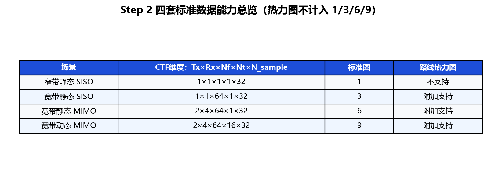
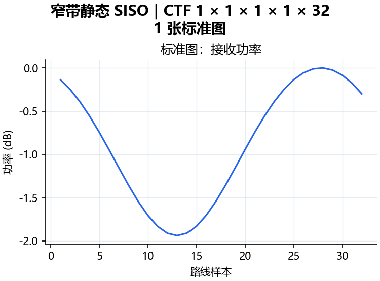
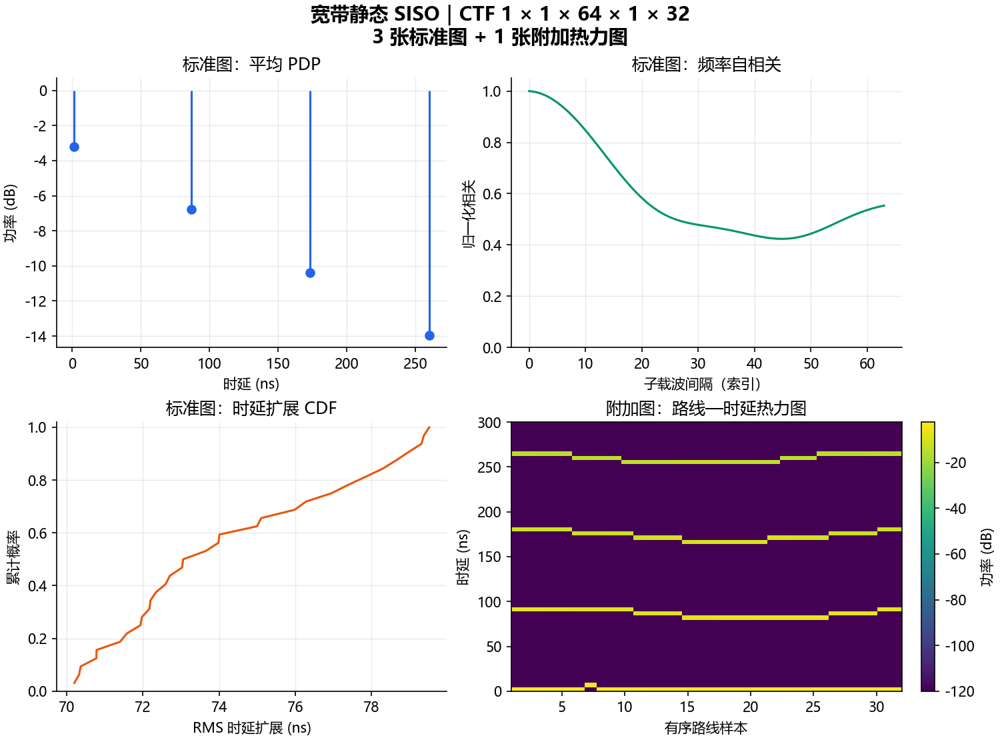
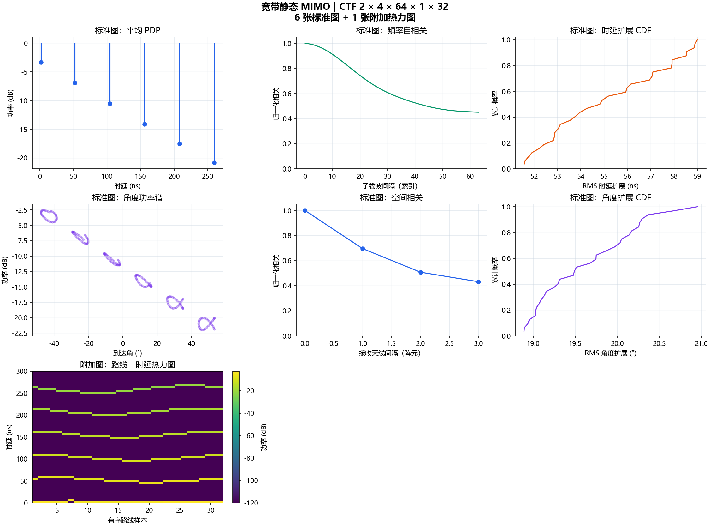
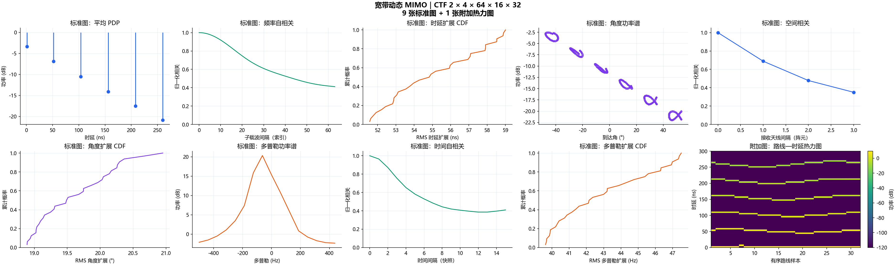

# Step 2 PR 前可视化审阅

> 这些图片是标准数据的质量检查预览，不是 Step 5 的正式平台绘图引擎。
> 审阅重点是尺寸、能力分级和物理变化是否符合约定，不评价预测准确度。

## 一眼看懂四套数据

## 1. 窄带静态 SISO

- CTF：`1 × 1 × 1 × 1 × 32`
- CIR：`1 × 1 × 1 × 1 × 32`
- 标准图：1 张
- 热力图：窄带无可分辨时延轴，因此不提供

## 2. 宽带静态 SISO

- CTF：`1 × 1 × 64 × 1 × 32`
- CIR：`1 × 1 × 4 × 1 × 32`
- 标准图：3 张
- 热力图：1 张附加审阅图，不计入标准数量

## 3. 宽带静态 MIMO

- CTF：`2 × 4 × 64 × 1 × 32`
- CIR：`2 × 4 × 6 × 1 × 32`
- 标准图：6 张
- 热力图：1 张附加审阅图，不计入标准数量

## 4. 宽带动态 MIMO

- CTF：`2 × 4 × 64 × 16 × 32`
- CIR：`2 × 4 × 6 × 16 × 32`
- 标准图：9 张
- 热力图：1 张附加审阅图，不计入标准数量

## 建议你的审阅顺序

1. 先看总览表中的四个维度和 1/3/6/9 数量是否正确。
2. 再看每张组合图是否随着数据维度增加而逐级增加。
3. 检查所有场景的热力图横轴是否都是 32 个有序路线样本。
4. 检查动态 MIMO 是否能明显看到时间和多普勒相关变化。
5. 确认图片中没有 RMSE、NMSE、Ground Truth 或准确度对比。
