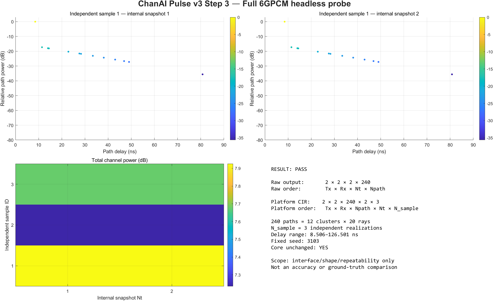

# Step 3 PR 前可视化审阅

> 这张图只用于检查“真实 6GPCM 是否能调用、输出是否合理、尺寸是否转换正确”。它不是准确度图，也不是 Step 5/12 的正式平台绘图界面。



## 四个区域分别怎么看

### 左上和右上：两个内部时刻的路径功率

- 横轴是路径时延，单位 ns；
- 纵轴是相对最强路径的功率，单位 dB；
- 每个点来自 6GPCM 生成的复数系数取模平方；
- 两张图对应同一个独立样本的 `Nt=1` 和 `Nt=2`；
- 240 条射线中，同一多径簇的射线可能具有相同或接近时延，所以点会重叠，看起来少于 240 个。

合格现象：

- 有一条或少数较强路径；
- 其他较晚路径通常更弱；
- delay 都是非负有限数；
- 两个内部时刻都能正常读取。

它不证明：

- 该信道与真实测量完全一致；
- 参数优化已经正确；
- 预测准确度已经达标。

### 左下：三个独立样本的总功率

- 横轴是 6GPCM 单次实现内部的两个时刻；
- 纵轴是三个独立样本编号；
- 颜色表示全部天线和路径累加后的总功率。

注意：纵轴不是道路位置。因为当前 `N_sample=3` 的含义是三个独立随机实现，所以这里只能按样本 ID 排列，不能解释为“车辆从位置 1 走到位置 3”。

### 右下：尺寸与完整性摘要

最重要的是看：

```text
Raw output:      2 × 2 × 2 × 240
Platform CIR:    2 × 2 × 240 × 2 × 3
Core unchanged:  YES
```

这说明：

1. 原始输出中路径在第四维；
2. 转换后路径放到平台第三维；
3. 三个独立样本统一放到第五维；
4. 调用没有改动完整版核心文件。

## 人工审阅建议

- [ ] 图中没有 RMSE、NMSE、Ground Truth 或准确度对比；
- [ ] 两张路径功率图横轴是非负时延；
- [ ] 右下角维度与约定一致；
- [ ] `N_sample=3` 明确写成独立实现；
- [ ] 没有把三个样本画成道路位置；
- [ ] `Core unchanged` 为 `YES`。
