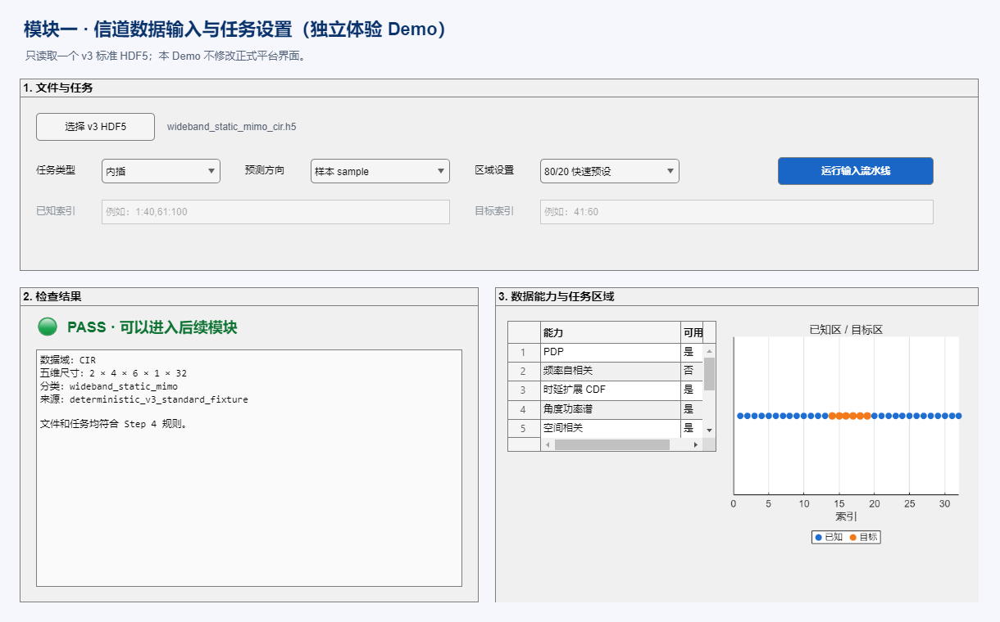

# Step 4 人工与可视化审阅指南

## 1. 独立 Demo



运行：

```matlab
addpath("examples");
step4_ingestion_demo
```

该 Demo 只调用 Step 4 核心，不修改 `ChannelSimulatorApp`。正式三页 UI 接入仍在 Step 12。

## 2. 建议审阅顺序

### A. 标准 fixture

```text
demo_data/v3_standard_fixtures/wideband_static_mimo_cir.h5
```

预期：

```text
PASS
CIR
2×4×6×1×32
wideband_static_mimo
```

选择 `sample + interpolation + 80/20` 后，橙色目标区应位于蓝色已知区中间。

### B. 横向道路1小型转换版

本地非 Git 文件：

```text
outputs/step4_review/road1_first20_TECHNICAL_200MHz_v3_cir.h5
```

预期：

```text
PASS
CIR
1×16×683×1×20
```

重点检查：

- 复数 CIR 未被转成 DPSD；
- 20 个文件按自然数字顺序合并；
- PDP、时延扩展 CDF、空间相关和样本-时延热力图能力可用；
- frequency/time/angle 能力不会被无依据升级。

文件名中的 200 MHz 是技术假设，不能作为正式测量带宽结论。

### C. WiFo 转换版

本地非 Git 文件：

```text
outputs/step4_review/wifo_3D_CSI_01_v3_cir.h5
```

预期：

```text
PASS
CIR
16×4×8×1×1000
```

重点检查：

- 16 Tx、4 Rx、8 path、1000 sample 未被错误解释成 1024 子载波；
- 来源显示为 legacy WiFo；
- sample 外推 80/20 的目标区位于末尾。

### D. 原始旧 WiFo

原始 `3D_CSI_01.h5` 不是 v3。调用：

```matlab
result = import_channel_dataset("原始3D_CSI_01.h5");
```

预期：

```text
FAIL
category = legacy_wifo_hdf5
提示先使用 convert_legacy_wifo_hdf5_to_v3
```

## 3. 手动任务检查

选择：

```text
内插 + sample + 手动索引
已知：1:8,13:20
目标：9:12
```

应通过，橙色目标点位于蓝色已知点内部。

再测试错误任务：

```text
已知：1:10
目标：10:12
```

应 FAIL，因为已知区和目标区重叠。

## 4. 人工审阅重点

- 是否能看懂 PASS/WARNING/FAIL；
- 五维尺寸是否按固定顺序显示；
- 错误文件是否给出下一步做法；
- 内插/外推示意是否直观；
- 能力表是否只开放数据真正支持的功能；
- Demo 是否与正式平台隔离；
- 原始文件是否保持不变。

## 5. 当前科学边界

Step 4 证明的是输入、转换和任务规则正确。它不证明：

- 200 MHz 是横向道路真实带宽；
- SAGE delay 单位已经确认；
- `sage{1}/sage{2}` 含义已经确认；
- 信道生成或预测准确度；
- Step 5 信道特性计算已经完成。
