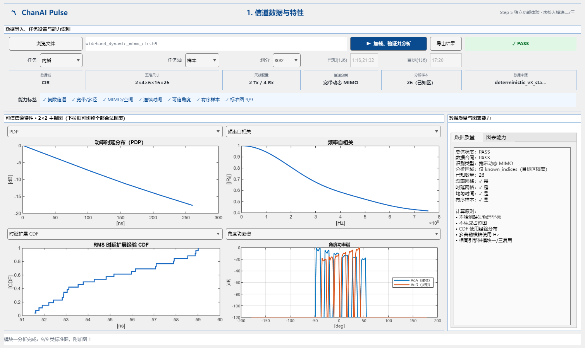
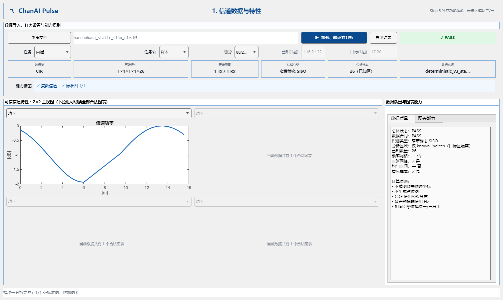
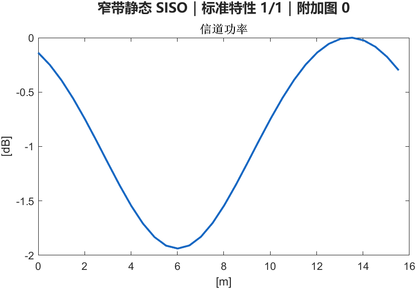
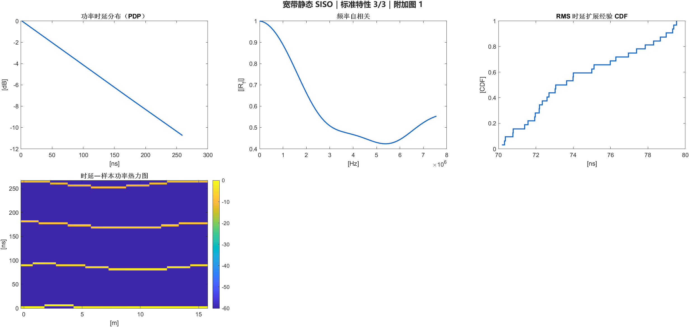
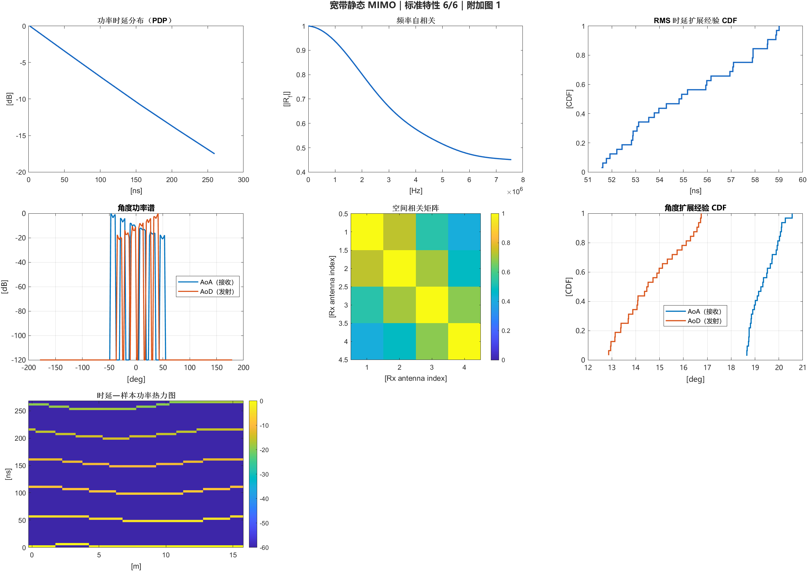
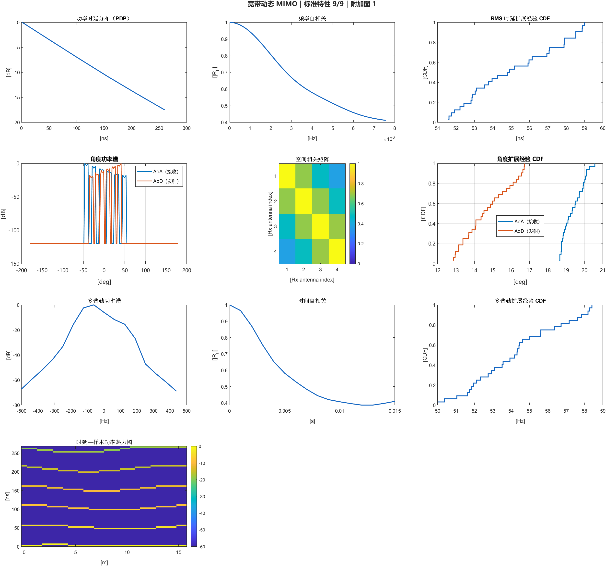

# Step 5 第一页 Demo 与图表人工审阅指南

## 1. Demo 截图



Demo 是未来正式平台第一页的独立功能原型。它真实调用 Step 4 输入流水线和
Step 5 特性引擎，但不修改正式 App，也不显示第二、第三模块。

窄带 SISO 严格门控审阅：



该页能力标签只能是复数信道和标准图 `1/1`，图表区只能选择功率，不得因为
标准合成 CIR 内部附带 AoA/AoD 而开放角度图。

## 2. 启动

在 MATLAB 中：

```matlab
cd("<Step 5 工作树>")
addpath("examples")
step5_module1_demo
```

操作顺序：

1. 点击“浏览文件”；
2. 选择一个 v3 `.h5`；
3. 选择内插/外推、任务轴和80/20或手动索引；
4. 点击“加载、验证并分析”；
5. 查看状态、六张摘要卡、能力标签、2×2主图和右侧质量说明；
6. 使用每个图上方下拉框切换所有合法特性；
7. 需要时点击“导出结果”，另存分析、任务和摘要 MAT；原始 HDF5 不修改。

当前手动索引是 MATLAB 内部一基位置，已在界面标为“1起”。完整自动换算仍
登记在 `UI-TODO-001`，留到 Step 12。

## 3. 四套标准数据

目录：

```text
demo_data/v3_standard_fixtures/
```

建议优先加载 CIR 文件：

| 文件 | 理想标准图 | 附加图 |
|---|---:|---:|
| `narrowband_static_siso_cir.h5` | 1 | 0 |
| `wideband_static_siso_cir.h5` | 3 | 1 |
| `wideband_static_mimo_cir.h5` | 6 | 1 |
| `wideband_dynamic_mimo_cir.h5` | 9 | 1 |

因此界面下拉框的精确可见数量应分别为 `1、4、7、10`：后一项是
`1/3/6/9` 标准图加上合法的附加热力图。不得再混入普通功率或 SISO 角度图。

对应审阅页：

- 
- 
- 
- 

CTF 配对文件也应达到同一理想数量；其中 PDP 由明确均匀频率轴做 IFFT，
角度图只在显式 ULA 几何存在时使用波束空间计算。

## 4. 每张图怎么读

### 功率

- 来源：复数信道模平方 `|H|²`；
- 默认纵轴：峰值归一化 dB；
- 窄带静态 SISO 的标准集合只有这一类；
- 最大值应为 `0 dB`，不是绝对接收功率声明。

### PDP

- 横轴：时延，当前显示 ns；
- 纵轴：相对功率 dB；
- 越靠右代表到达越晚的多径；
- 最强径归一化为 `0 dB`；
- 没有可信时延轴时不应出现。

### 频率自相关

- 横轴：频率间隔 Hz；
- 纵轴：相关幅度 `|R_f|`；
- 零频率间隔必须为1；
- 曲线下降表示相隔越远的子载波越不相似；
- 没有均匀频率网格时不应出现。

### RMS 时延扩展经验 CDF

- 横轴：每个样本的 RMS 时延扩展；
- 纵轴：不超过该值的样本比例；
- 曲线必须单调不下降并最终到1；
- 不是高斯拟合；
- 少于20个样本应显示提示，只有1个样本时不画。

### 角度功率谱

- 横轴：角度 deg；
- 纵轴：相对功率 dB；
- AoA 和 AoD 分开；
- 峰代表能量较强的到达/离开方向；
- 按冻结的维度规则，SISO即使携带生成器角度字段也不显示；
- 没有逐径角度或可信 ULA 几何时不应出现。

### 空间相关矩阵

- 横纵轴：Tx或Rx天线索引；
- 颜色：相关幅度；
- 对角线必须为1；
- 非对角线越亮表示不同天线信道越相似；
- 至少需要两个有效信道观测，只有一次观测时不应出现；
- 没有阵列几何时只能解释为天线索引相关，不能解释成距离。

### 角度扩展经验 CDF

- 横轴：逐样本角度扩展 deg；
- AoA/AoD 分开；
- 曲线必须单调到1；
- 表示角度能量分散程度的统计分布。

### 多普勒功率谱

- 横轴：真实 Hz，不是旧版 `-1～1`；
- 纵轴：相对功率 dB；
- 峰位置反映主要多普勒分量；
- 需要均匀时间轴；
- 第一版使用 Hann 窗，并在 metric 中保存采样率和 FFT 长度。

### 时间自相关

- 横轴：时间间隔 s；
- 纵轴：相关幅度 `|R_t|`；
- 零时间间隔必须为1；
- 下降越快通常表示信道随时间变化越快。

### 多普勒扩展经验 CDF

- 横轴：逐样本多普勒扩展 Hz；
- 纵轴：经验 CDF；
- 曲线必须单调到1；
- 需要多个样本和有效连续时间。

### 时延—样本功率热力图

- 横轴：路线累计距离或样本编号；
- 纵轴：时延；
- 颜色：功率；
- 可观察主径随路线发生时延变化；
- 只对声明为有序的样本开放；
- 它是附加图，不计入1/3/6/9。

## 5. road1 与 WiFo 降级审阅

本地忽略目录：

```text
outputs/step5_review/
```

两个转换文件均被识别为宽带静态 MIMO，但当前只达到 `3/6`：

- PDP；
- 时延扩展 CDF；
- 空间相关；
- 附加时延—样本热力图。

缺少可信频率网格和角度定义，所以频率自相关、角度功率谱和角度扩展 CDF
不能生成。这是正确降级，不是功能失败。

## 6. 人工验收重点

- [ ] 页面只显示模块一，不出现空的模块二/三；
- [ ] 标准 CIR 分别显示1/3/6/9；
- [ ] 四套标准数据的下拉框精确为1/4/7/10项，不出现额外功率或SISO角度图；
- [ ] 宽带有序数据显示附加热力图；
- [ ] 下拉框可以切换全部合法图；
- [ ] 相关函数零间隔为1；
- [ ] CDF单调并最终为1；
- [ ] 空间相关矩阵对角线为1；
- [ ] 多普勒横轴为Hz；
- [ ] road1/WiFo显示3/6并解释缺失能力；
- [ ] 目标区不进入正式特性计算；
- [ ] 不出现 Ground Truth、RMSE、NMSE 或准确度图；
- [ ] FAIL 数据不会生成占位曲线。
