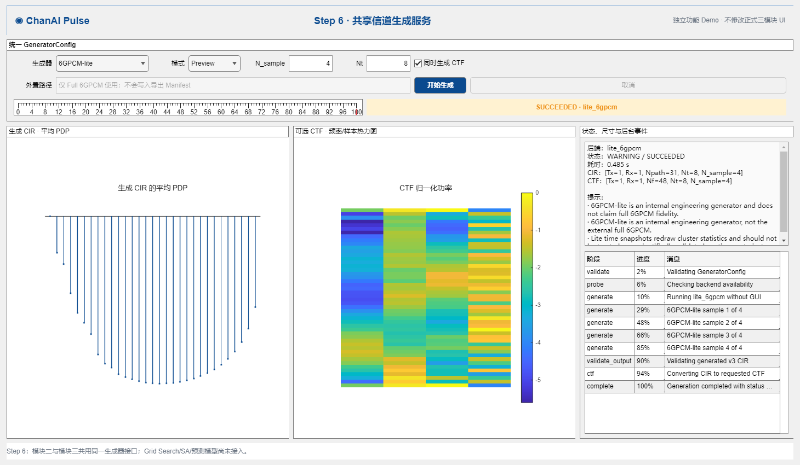
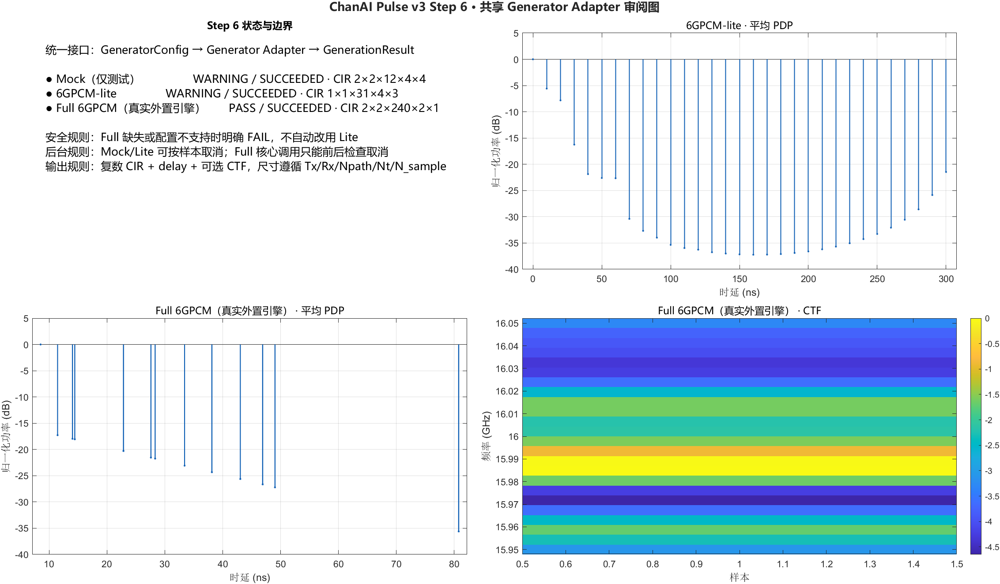

# Step 6 Demo 与人工审阅说明

## 1. 当前审阅图片

### 独立功能 Demo



该截图使用 `6GPCM-lite`，展示一次真实的共享接口调用结果。它应同时包含：

- `WARNING / SUCCEEDED` 状态；
- CIR `1×1×31×8×4`；
- CTF `1×1×48×8×4`；
- 平均 PDP；
- CTF 频率—样本热力图；
- 后台阶段和进度事件；
- Lite 不能冒充完整版 6GPCM 的限制说明。

### 三后端静态审阅图



该图实际调用 Mock、Lite 和真实外置 Full 6GPCM。Full 一栏应为
`PASS / SUCCEEDED`，CIR 尺寸应为 `2×2×240×2×1`。

## 2. 审阅入口

```matlab
addpath("examples");
step6_generator_adapter_demo
```

这是一套与正式平台隔离的功能 Demo，只用于检查 Step 6 的真实接口能力。界面风格不是 Step 12 的最终 UI。

## 3. 推荐人工操作

### Mock

1. 选择“Mock（测试）”；
2. 保持 `N_sample=6`、`Nt=4`；
3. 勾选 CTF；
4. 点击“开始生成”。

应看到：

- `WARNING / SUCCEEDED`；
- CIR 尺寸与配置完全一致；
- 有 PDP 和 CTF 图；
- 提示 Mock 只用于测试，不能代表物理 6GPCM。

### 6GPCM-lite

1. 选择“6GPCM-lite”；
2. 设置 `N_sample=4`、`Nt=8`；
3. 点击“开始生成”。

应看到：

- 得到合法复数 CIR 和可选 CTF；
- 输出固定为 SISO；
- 保留 Lite 工程生成器限制；
- 不出现“完整版 6GPCM”字样。

### Full 6GPCM

1. 选择“Full 6GPCM（外置）”；
2. 填入外置根目录；
3. 保持 `Nt=2`；
4. 点击“开始生成”。

应看到：

- 路径正确时调用真实外置引擎；
- 核心前后哈希一致；
- 本机路径不出现在结果 Manifest；
- 路径错误时明确 `FAIL`，且不会自动显示 Lite 结果；
- 把 `Nt` 改成其他值时明确说明历史入口固定 `Nt=2`。

## 4. 取消按钮

Mock/Lite 在样本之间检查取消，因此样本较多时可以中断。Full 6GPCM 核心不允许修改，目前只能在进入核心前和返回后检查取消。Demo 和结果能力信息都必须如实说明，不能伪造“核心内部实时取消”。

## 5. 图应该怎样看

- 左图是生成 CIR 的平均 PDP：横轴是时延，纵轴是归一化功率；
- 中图是由同一 CIR 计算得到的 CTF 功率热力图；
- 右侧是后端身份、状态、五维尺寸、WARNING/FAIL 和后台事件。

这些图用于确认“确实生成了复数信道且尺寸正确”，不是信道生成准确度图，也不是预测准确度图。

## 6. 人工审阅判断标准

- 成功时才允许显示由本次结果计算出的 PDP/CTF；
- `FAIL` 或 `CANCELLED` 时结果图必须清空；
- Mock 必须明确标为测试数据；
- Lite 必须明确标为工程生成器；
- Full 缺失或配置不支持时不得出现 Lite 图；
- Full 运行后必须报告核心哈希未变化；
- Manifest 和界面错误信息不得出现本机外置根目录；
- 本 Demo 不出现 Grid Search、SA、预测模型或准确度图。

自动生成的两张图片放在：

```text
docs/v3.0/review_assets/step6/step6_generator_adapter_demo.png
docs/v3.0/review_assets/step6/step6_generator_adapter_review.png
```

这些图片用于功能审阅，不代表 Step 12 的最终界面风格。
